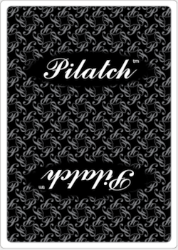
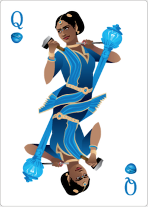
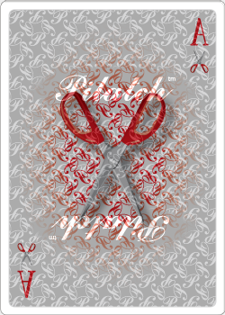

# pilatch-card

A simple web component for Pilatch playing cards

## Installation

From your command line

```bash
yarn add pilatch-card
yarn install --flat
```

In your HTML add polyfills, the helper this depends on, the HTML import and the stylesheet.

```html
<script src="/node_modules/@webcomponents/webcomponentsjs/custom-elements-es5-adapter.js"></script>
<script src="/node_modules/@webcomponents/webcomponentsjs/webcomponents-loader.js"></script>
<script src="/dist/pilatch-card.es5.js"></script>
```

## Usage

```html
<pilatch-card></pilatch-card>
<pilatch-card rank="12" suit="rock" up></pilatch-card>
<pilatch-card rank="14" suit="scissors" known></pilatch-card>
<pilatch-card binary></pilatch-card>
```






### Unknown

Unknown cards are the simplest, just displaying the card-back. They are created without any HTML attributes.

### Suit

Pilatch cards (other than binary cards) are grouped into three suits: `rock`, `paper`, and `scissors`. Use the `suit` HTML attribute and provide it one of those three values.

### Rank

The suited Pilatch cards can have ranks between `1` and `15`, inclusive. Use the `rank` HTML attribute and provide it a value in that range. `1` through `10` are numeric ranks. `11` is Jack. `12` is Queen. `13` is King. `14` is Ace. `15` is Joker.

### Up

To flip a card over, add or remove its `up` HTML attribute. All ranked, suited Pilatch cards will appear with the same card back until an `up` attribute is added.

### Binary

Binary cards say "UP" on one side and "DOWN" on the other. Add the `binary` HTML attribute to create one. Each binary card is DOWN by default. Add the `up` HTML attribute to flip it.

### Clickable

To make a card have `cursor: pointer` add the `clickable` HTML element.
Clicking it won't do anything out-of-the-box.
Your application must decide how to handle those events, and attach event listeners to `<pilatch-card>` elements.

### Known

If a player knows what a face-down card is, then add the `known` HTML attribute to make the back-face translucent.

### No Transition

To have cards instantaneously switch between their up and down sides, instead of using CSS transitions, add the `no-transition` HTML attribute. This is especially useful when rearranging `<pilatch-card>` elements in the DOM.

Read more on how that's helpful in [this blog post](https://experiments.pilatch.com/card-animation/) on animating web components with virtual DOM.

## Demo

For examples, clone this repository then run

```bash
yarn install
yarn start
```

...and navigate to http://localhost:3000

## Future

In the future this may depend on the web components v1 spec instead of v0. Pilatch cards may eventually use Shadow DOM when browser support/usage allows.
